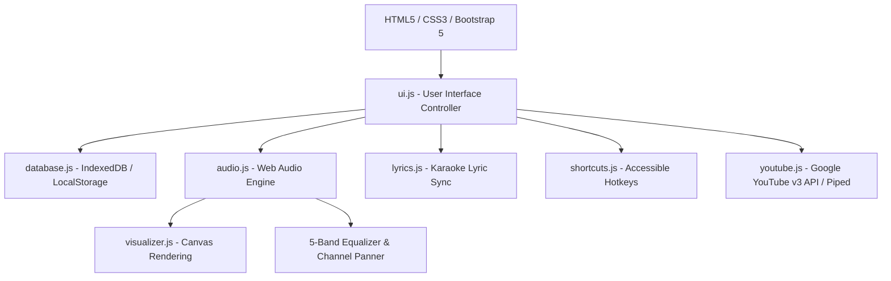

# BeatStream 🎵 - Premium Desktop-Grade Music Player

BeatStream is a desktop-grade, client-only premium music player platform built entirely with **Vanilla JS (ES6 Modules)**, **HTML5**, **CSS3 Custom Properties (Variables)**, and **Bootstrap 5**. It features high-fidelity Web Audio API rendering, dynamic YouTube Music catalog searches, dynamic audio streaming, timed karaoke lyric sync, Canvas visualizers, and robust local persistence using IndexedDB.

The project is designed to run entirely serverless, running in any modern web browser.

---

## 🚀 Key Features

*   **Official YouTube Music API Search**: Integrates Google's YouTube Data API v3 to perform live catalog searches for titles, artists, covers, and durations. Features a resilient fallback to public CORS-friendly Piped API instances.
*   **Dynamic Audio Streaming**: Resolves fresh YouTube stream URLs on the fly during playback, preventing link expiration.
*   **Bollywood Seed Library**: Seeded with **65 classic Bollywood songs** categorized across **12 movie-wise playlists**. Seed tracks dynamically resolve to real YouTube audio streams and official synchronized lyrics when played.
*   **Web Audio API Engine**: Uses a modular node graph (`AudioContext` -> `BiquadFilterNode` -> `StereoPannerNode` -> `GainNode` -> `AnalyserNode` -> Destination) to power a 5-band equalizer, stereo channel panning, and volume gain.
*   **Immersive Karaoke Lyrics**: Synchronizes LRC/LRCX lyrics. Supports automatic scrolling and timed word-by-word highlights using linear progress background fills. Clicking on a lyric line seeks the player directly.
*   **Ambient Canvas Visualizers**: Renders frequency and wave details in three styles:
    *   *Bars Mode*: Linear frequency spectrum analyzer.
    *   *Wave Mode*: Time-domain oscilloscope wave.
    *   *Circular Mode*: A particle-ring beat visualizer pulsating dynamically to bass frequencies.
*   **IndexedDB Track Persistence**: Local track imports (MP3/WAV files) are parsed for metadata and saved directly as binary blobs.
*   **Custom Settings & Backups**: Custom HSL themes, playback speeds (0.5x - 2.0x), and backups. Users can export/import all local settings and playlists as JSON file templates.

---

## 🛠 Tech Stack

*   **Frontend Core**: HTML5, CSS3 variables, Vanilla JavaScript (ES6 Modules)
*   **Styling**: Glassmorphic Panels, Backdrop Blurs, and Bootstrap 5
*   **Database**: IndexedDB (for audio binary files), LocalStorage (for queue states, themes, favorites, and playlists)
*   **APIs**: Google YouTube Data API v3 (Search, Videos), public CORS-enabled Piped API (Streams, Lyrics)

---

## 📦 Architecture Node Graph



---

## 🚦 Getting Started

### 1. Prerequisites
You need a web browser and a simple HTTP server (like Python's built-in server or Node's `http-server`) to run the application due to browser security settings for ES6 modules and `.env` fetch queries.

### 2. Setup YouTube API Key (Optional)
To query the official YouTube Data API v3 instead of public Piped proxies:
1. Create a project on the [Google Cloud Console](https://console.cloud.google.com/).
2. Enable the **YouTube Data API v3**.
3. Create an API Key in **Credentials**.
4. In the root directory of this repository, create a `.env` file and add the key:
   ```env
   YT_API_KEY="your_api_key_here"
   ```
   *Note: Alternatively, you can paste the key directly into the **YouTube API Settings** box in the app's Settings tab.*

### 3. Launching BeatStream
Run a simple HTTP server in the repository root:
*   **Using Python**:
    ```bash
    python -m http.server 8000
    ```
*   **Using Node.js**:
    ```bash
    npx http-server -p 8000
    ```

Open your browser and navigate to `http://localhost:8000`.

---

## 🎨 Design & Accessibility
*   **Gilroy & Inter Typography**: Crisp, modern font hierarchies.
*   **HSL Color System**: Switch between *Midnight Blue*, *Aurora Purple*, *Deep Graphite*, *Neon Violet*, and *Warm Ivory* themes instantly.
*   **Accessible Keyboards**: Accessible hotkeys mapped for play/pause (`Space`), seeking (`Left` / `Right` arrows), volume tuning (`Up` / `Down` arrows), muting (`M`), and playlist shuffling (`S`).

---

## 📁 Repository & Git History
BeatStream was built progressively using a simulated 3.5-month development lifecycle (September 15, 2024 to December 31, 2024) across **246 commits**. Detailed weekly journals, developer logs, and design assets are documented under `docs/`.
